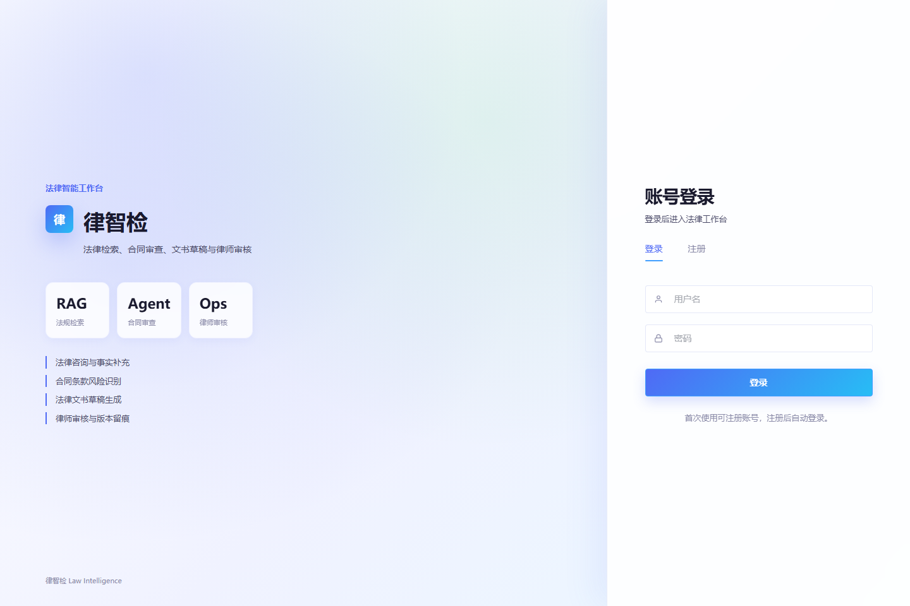
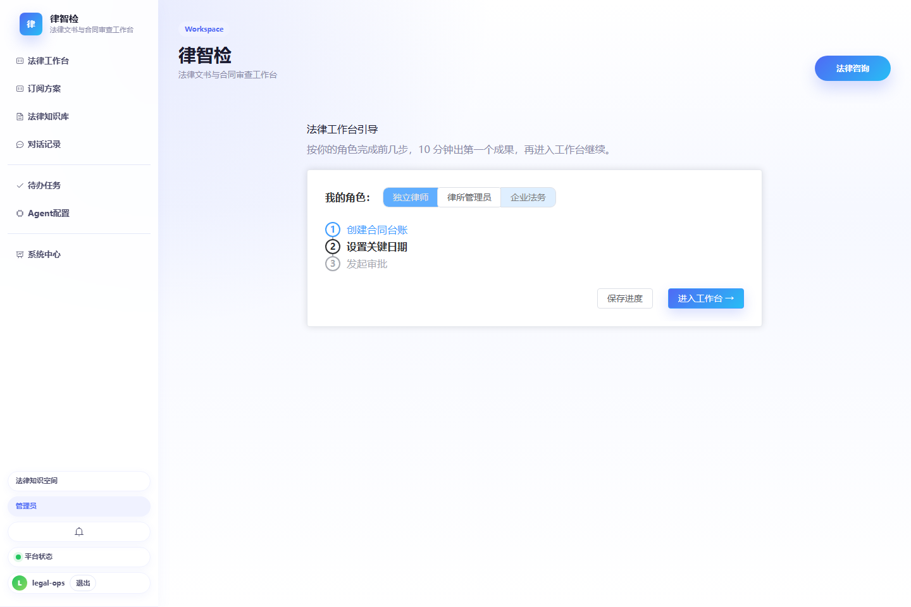
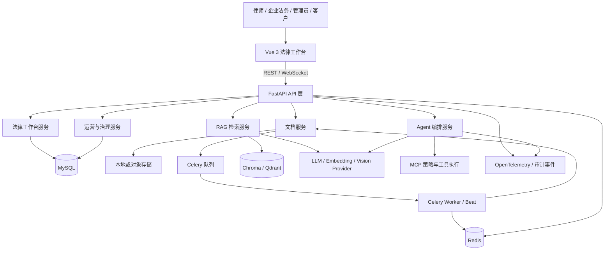
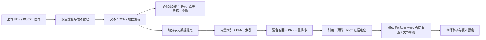
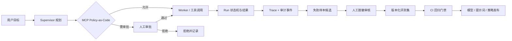

# 律智检

> 面向企业法务与律师团队的法律文书、合同审查和知识检索工作台。

律智检将法律咨询、合同风险审查、文书草稿、法规与案例检索、律师审核，以及受控的 Agent 执行收敛到同一套工作流中。系统面向真实业务资料设计：敏感数据在出站前经过分级与脱敏，写入型操作需要按策略审批，检索、工具调用和 Agent 决策均可审计回放。





## 能力概览

| 领域 | 已实现能力 |
| --- | --- |
| 法律工作台 | 法律咨询、合同审查、文书草稿、案件归档、律师审核、计时计费、关键日期与客户门户。 |
| 法律知识库 | 文档上传、版本管理、解析、向量检索、BM25、重排序、Agentic RAG、引用与法源有效性核验。 |
| 扫描合同理解 | 版面感知 OCR、置信度校验、印章/签字区域识别、表格与条款抽取、证据页码和坐标定位；可选择调用视觉模型辅助识别。 |
| Agent 编排 | Supervisor/Worker 执行、工具调用、敏感操作审批、幂等控制、Run 历史，以及受约束的内部 A2A 委派。 |
| 可观测与评测 | OpenTelemetry Trace、结构化 Agent 审计、线上失败样本候选集、人工脱敏审核、评测导出与回归门禁。 |
| 模型治理 | 按复杂度、风险、延迟与成本进行模型路由；支持 Shadow Traffic、稳定分桶 A/B、离线评测门禁和自动/人工回滚。 |

## 治理与安全

- **Policy-as-Code**：MCP 工具权限、可访问数据域、风险级别与审批要求由可版本化策略定义。策略决策带 Agent 身份、规则版本和结果，可重放并识别策略漂移。
- **最小权限与动态授权**：Agent 每次调用工具都重新校验当前授权；缺少数据域、超过风险阈值或审批未通过时默认拒绝。
- **可审计的 Agent 运行**：`agent.run`、`agent.tool_call`、`agent.retrieval` 与 `agent.state_transition` Trace 仅记录有界元数据，不写入请求正文、检索原文或模型输出。
- **线上评测闭环**：失败 Run 或工具失败会生成脱敏候选；管理员提供专门编写的评测输入与预期结果后，样本才进入版本化评测集和 CI 回归门禁。
- **受控 A2A 协作**：内部 Agent Card、任务委派和跨 Agent 审计继承父 Run 的用户、组织、Trace 与授权快照。当前实现不将本地 Agent 暴露为未经配置的远程执行端点。
- **法律数据保护**：出站 LLM 调用统一经过数据分级、PII 检测与脱敏；极敏感数据默认阻断。密钥、连接器凭据和法律数据采用独立密钥配置。

## 架构

项目采用模块化单体：Vue 3 提供法律工作台，FastAPI 提供 HTTP/WebSocket API；业务能力按领域组织在服务层中。MySQL 保存事务、版本和审计数据，Redis 支撑缓存、限流与任务协调，Celery 承担文档处理、索引、通知和运营任务，Chroma 或 Qdrant 提供向量检索。



### 分层与边界

| 层 | 职责 | 主要目录 |
| --- | --- | --- |
| 表现层 | HTTP、WebSocket、认证、请求响应与 OpenAPI 契约。 | `app/api/`、`frontend/src/` |
| 业务层 | 法律工作台、文档、RAG、Agent、计费、通知和组织等领域服务。 | `app/services/` |
| 领域与数据层 | SQLAlchemy 模型、Pydantic DTO、数据访问和版本控制。 | `app/models/`、`app/schemas/`、`app/repositories/` |
| 基础设施层 | 配置、数据库、缓存、LLM 网关、加密、遥测、错误处理。 | `app/core/` |
| 执行层 | MCP 工具策略与执行、Celery 异步任务。 | `app/mcp/`、`app/tasks/` |

后端只允许 `API -> Service -> Model/Repository -> Core` 的单向依赖；任务层可调用业务服务，但业务服务不反向依赖任务框架。详细边界见 [架构基线](docs/ARCHITECTURE.md)。

### 法律文档与检索链路



文档版本与多模态分析结果按版本持久化，避免新上传内容覆盖历史证据。OCR 置信度不足、缺少 Tesseract 或视觉模型失败时，系统会以可解释告警降级，而非把空结果当作可靠结论。

### Agent 治理闭环



这个闭环将线上失败信号转为经过人工控制的评测样本，并把策略、模型和提示词变化置于同一回归门禁下。生产请求正文不会自动进入评测集。

## 快速启动

### 前置条件

- Python 3.11
- Node.js 20+
- MySQL 8 和 Redis 7，或 Docker Compose
- 可用的 OpenAI 兼容模型 API Key；扫描件增强识别还需按部署环境安装 Tesseract，并配置 `LLM_VISION_MODEL`（可选）

### 1. 配置环境变量

基于示例创建 `.env`，至少填入数据库、Redis、管理员账号、应用密钥、法律数据加密密钥和 LLM 配置。

```powershell
Copy-Item .env.example .env
```

重点检查：`DATABASE_URL`、`REDIS_URL`、`SECRET_KEY`、`LEGAL_DATA_ENCRYPTION_KEY`、`LLM_API_KEY`、`ADMIN_USERNAME`、`ADMIN_PASSWORD`。Docker Compose 还需要 `DATABASE_URL_DOCKER` 与 `MYSQL_ROOT_PASSWORD`。

完整变量说明见 [配置参考](docs/CONFIG.md)。不要将 `.env`、真实合同、生产导出或任何 API Key 提交到仓库。

### 2. 本地开发

```powershell
python -m venv .venv
.\.venv\Scripts\Activate.ps1
python -m pip install -r requirements-dev.txt

python scripts/bootstrap_system.py
python -m uvicorn app.main:app --reload --host 127.0.0.1 --port 8001
```

另开一个终端启动前端：

```powershell
cd frontend
npm ci
npm run dev
```

访问 `http://127.0.0.1:5173`。文档解析、通知和定时任务依赖 Celery；如需一次性启动完整开发进程，请不要再手工启动上面的 API 和前端，并在准备好 MySQL 与 Redis 后运行：

```powershell
python scripts/start_dev_servers.py
```

### 3. Docker Compose

在已完成 `.env` 配置后：

```powershell
docker compose up --build -d
docker compose ps
```

前端默认发布在 `http://127.0.0.1:8080`，API 在 `http://127.0.0.1:8001`。Compose 启动 API 时会执行系统初始化与数据库迁移。运行状态、健康检查、备份和故障处置见 [运维手册](docs/operations-runbook.md)。

## 关键工作流

### 扫描合同分析

1. 上传 PDF 或图片合同并完成基础解析。
2. 调用 `POST /api/documents/{document_id}/multimodal-analyze`，可限定页码范围或启用视觉模型辅助。
3. 从 OCR 置信度、版面块、印章/签字区域、表格条款和风险义务行中查看结构化证据。
4. 使用 `POST /api/documents/{document_id}/evidence-locate` 返回证据所在页、摘录、OCR 置信度和坐标。

详见 [多模态法律文档理解](docs/MULTIMODAL_DOCUMENT_ANALYSIS.md)。OCR 或视觉模型不可用时，接口会明确返回降级告警，不能将空结果当作高置信度证据。

### Agent 可观测与线上评测

1. Agent Run、工具调用、检索与状态转移写入同一 `trace_id` 的结构化 Trace 与审计事件。
2. 失败 Run 自动沉淀为仅含摘要和哈希的待审核候选，不复制生产法律请求。
3. 管理员审核并编写可用于测试的输入与预期结果。
4. 导出版本化数据集，由 `eval.agent_online_eval.run_cases` 执行回归门禁。

详见 [Agent Observability and Online Evals](docs/AGENT_OBSERVABILITY_ONLINE_EVALS.md)。

### 模型路由与发布

文本调用先根据请求复杂度和风险选择小模型或主模型，再由发布控制面在成本、时延、能力和离线评测门禁均满足时进行影子或 A/B 流量分配。候选密钥只可由环境或密钥服务注入，不能写入发布记录。

详见 [模型路由与灰度发布](docs/MODEL_ROUTING_AND_ROLLOUT.md)。

## 验证

```powershell
# 后端测试
python -m pytest tests -q

# 迁移完整性
python -B scripts/check_migrations.py

# 前端构建与端到端测试
cd frontend
npm run build
npm run test:e2e
```

上线前的分层测试、覆盖率、OpenAPI 契约、迁移校验和性能检查见 [测试与发布工程手册](docs/TESTING_AND_RELEASE.md)。

## 截图更新

README 中的图片位于 `docs/images/`。前端服务运行在 `http://127.0.0.1:5173` 时，可用下列命令重新生成：

```powershell
cd frontend
node scripts/capture-readme-screenshots.mjs
```

首页截图会拦截页面 API 并使用脚本内的脱敏模拟数据，因此不会读取本地数据库、生产合同或模型密钥。

## 进一步阅读

| 主题 | 文档 |
| --- | --- |
| 架构与模块边界 | [ARCHITECTURE.md](docs/ARCHITECTURE.md) |
| MCP 策略、审计回放 | [MCP_POLICY_AS_CODE.md](docs/MCP_POLICY_AS_CODE.md) |
| 内部 A2A 协作 | [A2A_COLLABORATION.md](docs/A2A_COLLABORATION.md) |
| RAG 指标与评测 | [RAG_EVALUATION_GUIDE.md](docs/RAG_EVALUATION_GUIDE.md) / [EVAL_METRICS.md](docs/EVAL_METRICS.md) |
| 配置与环境变量 | [CONFIG.md](docs/CONFIG.md) |
| 发布与运维 | [operations-runbook.md](docs/operations-runbook.md) / [CANARY_AND_RELEASE.md](docs/CANARY_AND_RELEASE.md) |

## 使用边界

本系统用于法律信息检索、合同和文书处理的辅助工作。模型输出、条款识别结果、风险提示和自动生成的文书均应由具备相应资质的人员复核后使用，不构成自动法律意见或替代专业判断。
